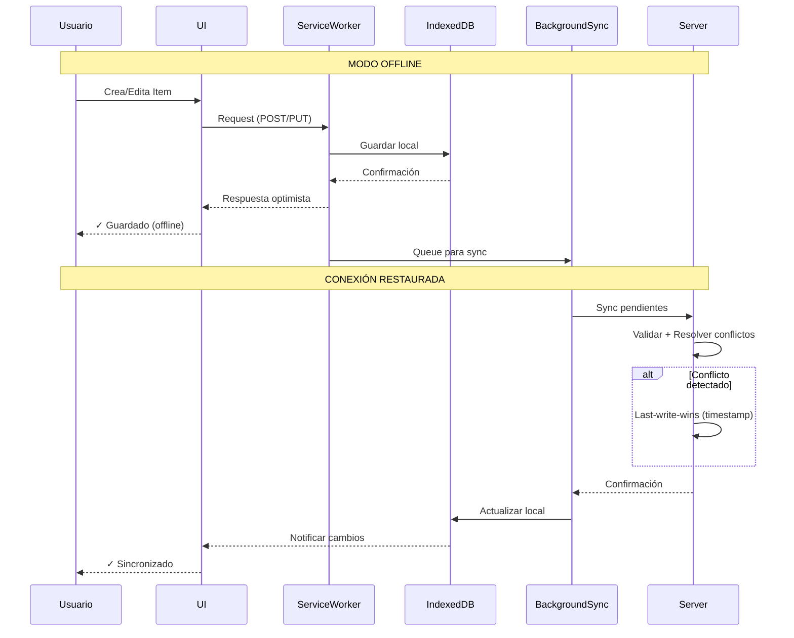

# 📱 InventarioFoto PWA

📦 PWA offline-first para gestión de inventario con fotos.Toma una foto, registra el producto. Si no existe el tipo, lo creas al instante. React + IndexedDB + Service Workers.

## 🚀 Demo Live

**Pruébalo aquí**: https://inventario-foto-pwa.onrender.com

### Qué probar:
1. Agrega items con fotos
2. Desconecta internet
3. Sigue usando la app (funciona offline)
4. Reconecta → Sincroniza automáticamente

## ⭐ Features

- ✅ **Offline-first**: Funciona sin internet
- ✅ **Sincronización inteligente**: Automática al reconectar
- ✅ **Resolución de conflictos**: Last-write-wins con timestamps
- ✅ **Búsqueda rápida**: Con fotos
- ✅ **Instalable**: PWA completa


# Arquitectura de InventarioFoto PWA


## Caracteristicas

- **Captura fotografica**: Usa la camara del celular
- **Offline-first**: Funciona sin internet
- **Tipos dinamicos**: Crea categorias "al vuelo"
- **PWA**: Instalable como app nativa
- **Responsive**: Disenado para uso en campo

## Stack

| Capa | Tecnologia |
|------|-----------|
| Backend | Python Flask + SQLite |
| Frontend | Vanilla JS + Tailwind CSS |
| Camara | getUserMedia API |
| Storage | IndexedDB (offline) |

## Instalacion

```bash
pip install -r requirements.txt
python app.py
```

Abre http://localhost:5000 en tu navegador.

En iOS/Android: Abre Safari/Chrome → Compartir → "Agregar a inicio"

## API Endpoints

| Metodo | Endpoint | Descripcion |
|--------|----------|-------------|
| GET | /api/productos | Lista productos |
| POST | /api/productos | Crea desde foto |
| DELETE | /api/productos/<id> | Elimina |
| GET | /api/tipos-producto | Lista tipos |
| POST | /api/tipos-producto | Crea tipo nuevo |
| POST | /api/sync | Sincroniza offline |
| GET | /api/estadisticas | Stats |

## 🔄 Arquitectura de Sincronización


#### Casos de Uso:

**1. Usuario Offline:**
- Usuario crea/edita item
- UI guarda en IndexedDB inmediatamente
- Operación encolada para sync
- Usuario ve confirmación instantánea

**2. Conexión Restaurada:**
- Background Sync detecta online
- Procesa queue de operaciones pendientes
- Envía batch al servidor
- Servidor resuelve conflictos por timestamp

**3. Conflictos:**
```javascript
// Last-write-wins strategy
const resolveConflict = (local, remote) => {
  return local.timestamp > remote.timestamp 
    ? local 
    : remote;
};
```

## Autor

Mario Manrique
