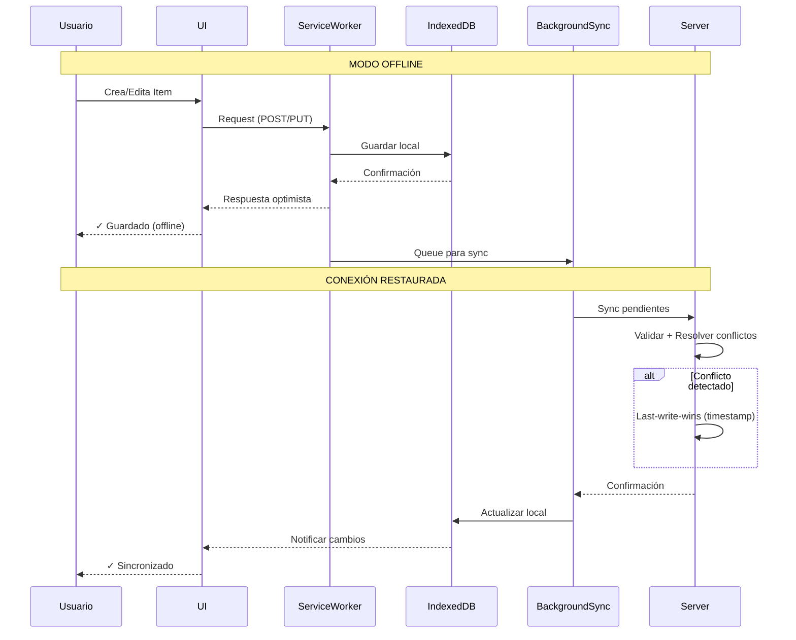

# 📱 InventarioFoto PWA

📦 PWA offline-first para gestión de inventario con fotos.Toma una foto, registra el producto. Si no existe el tipo, lo creas al instante. React + IndexedDB + Service Workers.

## 🚀 Demo Live

**Pruébalo aquí**: https://inventario-foto-pwa.onrender.com

### Qué probar:
1. Agrega items con fotos
2. Desconecta internet
3. Sigue usando la app (funciona offline)
4. Reconecta → Sincroniza automáticamente

## ⭐ Features

- ✅ **Offline-first**: Funciona sin internet
- ✅ **Sincronización inteligente**: Automática al reconectar
- ✅ **Resolución de conflictos**: Last-write-wins con timestamps
- ✅ **Búsqueda rápida**: Con fotos
- ✅ **Instalable**: PWA completa
- ✅ **Geolocalización**: Captura automática de coordenadas GPS al registrar productos
- ✅ **Análisis de imágenes con IA**: Detección automática de categoría y sugerencia de nombre
- ✅ **Escáner de código de barras**: Escanea EAN/UPC/Code128/QR con la cámara al crear o editar productos
- ✅ **Exportación a Excel/CSV**: Descarga el inventario completo o filtrado desde la vista Historial
- ✅ **Edición de productos**: Corrige nombre, cantidad, precio, tipo o foto desde el detalle
- ✅ **Gestión de tipos**: Renombra, cambia icono o elimina categorías (con reasignación de productos)
- ✅ **Paginación**: Carga por lotes de 50 con botón "Cargar más" (respuestas ligeras)
- ✅ **Persistencia real en producción**: Postgres + fotos en la BD (los datos sobreviven a los deploys de Render)


# Arquitectura de InventarioFoto PWA


## Caracteristicas

- **Captura fotografica**: Usa la camara del celular
- **Offline-first**: Funciona sin internet
- **Tipos dinamicos**: Crea categorias "al vuelo"
- **PWA**: Instalable como app nativa
- **Responsive**: Disenado para uso en campo

## Stack

| Capa | Tecnologia |
|------|-----------|
| Backend | Python Flask + SQLite (local) / PostgreSQL (producción) |
| Frontend | Vanilla JS + Tailwind CSS |
| Camara | getUserMedia API |
| Storage | IndexedDB (offline) |
| Ubicación | Geolocation API (navegador) |
| Análisis de imágenes | Google Gemini Vision API |

## Instalacion

```bash
pip install -r requirements.txt
python app.py
```

Abre http://localhost:5000 en tu navegador.

En iOS/Android: Abre Safari/Chrome → Compartir → "Agregar a inicio"

## API Endpoints

| Metodo | Endpoint | Descripcion |
|--------|----------|-------------|
| GET | /api/productos | Lista productos (filtros `tipo_id`, `q`; paginación `limit`/`offset`) |
| POST | /api/productos | Crea desde foto |
| PUT | /api/productos/<id> | Edita (parcial, foto opcional) |
| DELETE | /api/productos/<id> | Elimina (y su foto) |
| GET | /api/tipos-producto | Lista tipos con nº de productos |
| POST | /api/tipos-producto | Crea tipo nuevo |
| PUT | /api/tipos-producto/<id> | Edita tipo |
| DELETE | /api/tipos-producto/<id> | Elimina tipo (`?reasignar_a=` si tiene productos) |
| GET | /api/export | Exporta a Excel/CSV (`?formato=xlsx\|csv`) |
| GET/POST | /api/config | Configuración (símbolo de moneda) |
| GET | /fotos/<id> | Sirve fotos desde la BD |
| POST | /api/sync | Sincroniza offline |
| GET | /api/estadisticas | Stats |
| POST | /api/clasificar | Análisis de imagen con IA |

Detalle completo en [API.md](API.md).

## 🌍 Geolocalización

Cuando registras un producto, la app **captura automáticamente tu ubicación GPS** (si el navegador lo permite). Esto es útil para:

- Rastrear dónde se registraron los productos
- Asociar inventario a ubicaciones físicas
- Análisis geográfico de movimiento de productos

**¿Cómo funciona?**

1. Al capturar una foto de un producto, el navegador pide permiso de ubicación
2. Se registran las coordenadas (latitud/longitud) junto con el producto
3. En el detalle del producto, aparece un link a Google Maps con la ubicación

**Dato técnico**: Usa Geolocation API estándar del navegador

## 🤖 Análisis de Imágenes con IA

La app puede **analizar automáticamente la foto del producto** para:

- ✅ Detectar la categoría (tipo de producto)
- ✅ Sugerir un nombre descriptivo

**¿Cómo funciona?**

1. Cuando cargas una foto, se envía al servidor para análisis
2. Un modelo de visión por computadora examina la imagen
3. Propone una categoría y nombre sugerido
4. Tú puedes aceptar o cambiar la sugerencia

**Ejemplos:**

- Foto de pintura roja → Detecta "Pintura" → Sugiere "Pintura roja brillante"
- Foto de herramienta → Detecta "Herramientas" → Sugiere "Destornillador Phillips"

**Configuración:**

Para usar esta función, configura la variable de entorno:

```bash
export GEMINI_API_KEY="tu-api-key-aqui"
```

Si no está configurada, la app funciona normalmente sin análisis automático.

**Nota**: El análisis solo ocurre cuando tienes conexión (es una petición al servidor).

## 🔄 Arquitectura de Sincronización


#### Casos de Uso:

**1. Usuario Offline:**
- Usuario crea/edita item
- UI guarda en IndexedDB inmediatamente
- Operación encolada para sync
- Usuario ve confirmación instantánea

**2. Conexión Restaurada:**
- Background Sync detecta online
- Procesa queue de operaciones pendientes
- Envía batch al servidor
- Servidor resuelve conflictos por timestamp

**3. Conflictos:**
```javascript
// Last-write-wins strategy
const resolveConflict = (local, remote) => {
  return local.timestamp > remote.timestamp 
    ? local 
    : remote;
};
```

---

## 📖 Documentación Completa

- **[FEATURES.md](FEATURES.md)** - Guía detallada de cada característica (geolocalización, IA, etc.)
- **[SETUP.md](SETUP.md)** - Instrucciones de instalación y configuración de variables de entorno
- **[RESUMEN_EJECUTIVO.md](RESUMEN_EJECUTIVO.md)** - Análisis arquitectónico y refactorización
- **[README.md](README.md)** (este archivo) - Visión general y guía rápida

---

## 🎓 ¿Por dónde empezar?

1. **¿Quieres saber qué hace la app?**
   → Lee este [README.md](README.md)

2. **¿Quieres instalar y configurar?**
   → Sigue [SETUP.md](SETUP.md)

3. **¿Quieres entender las características?**
   → Lee [FEATURES.md](FEATURES.md)

4. **¿Quieres conocer la arquitectura?**
   → Consulta [RESUMEN_EJECUTIVO.md](RESUMEN_EJECUTIVO.md)

---

## 💡 Notas de Desarrollo

### Últimas Características Agregadas (Julio 2026)

✅ **Persistencia en producción**: Postgres + fotos en la BD (antes se perdían los datos en cada deploy de Render)

✅ **Edición de productos** y **gestión de tipos** (renombrar, cambiar icono, eliminar con reasignación)

✅ **Escáner de código de barras** (BarcodeDetector nativo + fallback ZXing)

✅ **Exportación a Excel/CSV** con filtros y **paginación** del listado

### Características de Mayo 2026

✅ **Geolocalización GPS**: Captura automática de coordenadas al registrar productos

✅ **Análisis de Imágenes con IA**: Detección automática de categoría y nombre usando Google Gemini Vision

### Cómo reportar problemas

Si encuentras un bug:
1. Verifica que esté en la [lista de issues](https://github.com/marius1973/inventario-foto-pwa/issues)
2. Si es nuevo, abre un issue describiendo:
   - Qué esperabas que pasara
   - Qué pasó en realidad
   - Pasos para reproducir
   - Navegador y sistema operativo

---

## 🔐 Seguridad

- Las imágenes se procesan en el servidor
- La ubicación GPS se guarda localmente (en tu base de datos)
- Las claves de API se configuran con variables de entorno
- No hay rastreo de usuarios
- Los datos se sincronizan encriptados (HTTPS)

---

## Autor

Mario Manrique - 2026


